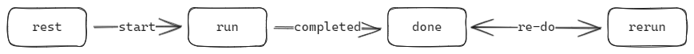

# @innu/phasor

This library helps manage async operations as state machine objects. This might work well for representing a network call's state or any async operation's progress as an object.

## Phasor state machine



1. A phasor is at `rest` until is has been acted upon the first time
2. The phasor is then at `run` when it was acted upon once.
3. The phasor can then be at `done` phase.
4. The phasor can enter `rerun` phase after that for redoing the operation with new inputs or just to retry on error.

## Usage

The main export of this library is the types. Imagine you needed to represent a network call made to fetch search results based on a search string. This is how you would represent it as a Phasor -

```ts
import { Phase, Result } from '@innu/phasor';
import { SearchResult, SearchErrors } from './types.ts'; // assuming this exists

type SearchResultPhasor = Phasor<string, Result<SearchResult[], SearchErrors>>;
```

You could then initialize an object with it like this -

```ts
let searchResult: SearchResultPhasor = {
  phase: Phase.Rest,
};
```

or, you could use the factory class included in the library like so -

```ts
import { ph } from '@innu/phasor';

let searchResult: SearchResultPhasor = ph.rest();
```

now you can update the `searchResult` object as and when your search operation reaches different stages.

```ts
// when search was initiated
searchResult = ph.run(searchInput);

// when search completes with success
searchResult = ph.done(searchInput, response);
```
